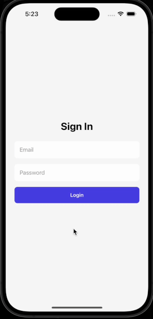
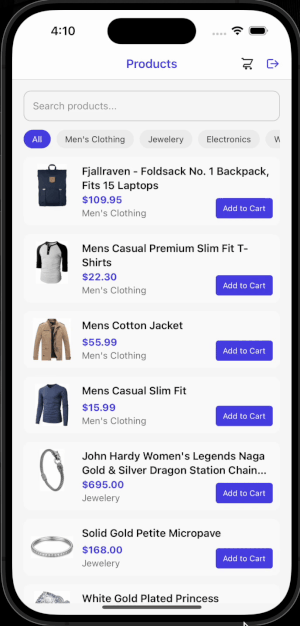

# ShopIT

## Features

- **AWS Cognito Authentication**
  Secure sign-in access tokens managed via Cognito. 

- **Product Listing from FakeStore API**  
  Fetches and displays products with images, titles, descriptions, prices, and ratings with Search and Category filter.

- **Product Details screen**  
  Show full details of the Product with title, image, description, price and ratings, also Cart manupulation can be done on the screen, and is accisble from Products and Cart screens both.

- **Cart Management with GraphQL**  
  Add items with quantity to cart, view cart, update or remove items — all persisted via `upsertItem`, `listItems`, and `getItem` queries/mutations.

- **Offline Support with AsyncStorage**
  Cart is stored locally and chanelized through Redux operations.

- **Optional Enhancements**
  - Additional handle for first time login to set new password shown on Demo GIF below, works only once
  - Quantity editing and removal within cart
  - Access of Product Details screen from Cart and Products screen
  - Real time cart item quantity display on Cart button on Navigation Bar
  - All cart operations handled in the Product Details screen specific to origin of the screen with different conditions
  - Basic error handling across all screens
  - Clean, intuitive UI/UX with external Font and Centralized theme color change option

---

## Tech Stack

- React Native CLI
- TypeScript
- Redux Toolkit for state management
- AWS Cognito for Auth
- GraphQL for cart operations
- REST API (`https://fakestoreapi.com/`) for product data

---

## API Details

- **Product Data:**  
  `https://fakestoreapi.com/products`

- **Cart Management (GraphQL):**

  - `upsertItem` – Add/update cart items
  - `listItems` – Get all cart items
  - `getItem` – Get individual item details
  - `clearCartItems` - Clears all the items in the Cart

- **Cart Management (Redux):**
  - `loadCart` – Keeps the Cart Items from server

---

## Configuration

> All the configuration setup can be altered from src/config folder

---

# Getting Started

### Setup Instructions

> **Note**: Make sure you have completed the [Set Up Your Environment](https://reactnative.dev/docs/set-up-your-environment) guide before proceeding.

## Step 1: Install dependencies using npm

To install dependencies, run the following command from project root folder

```sh
# Using npm
npm install
```

## Step 2: Make sure Pods are installed properly

To check or, install any missing Pods run the following command from project root folder

```sh
# Using npm
npx pod-install
```

## Step 3: Build and run your app

With Metro running, open a new terminal window/pane from the root of your React Native project, and use one of the following commands to build and run your Android or iOS app:

### Android

```sh
react-native run-android
```

### iOS

```sh
react-native run-ios
```

If everything is set up correctly, you should see your new app running in the Android Emulator, iOS Simulator, or your connected device.

This is one way to run your app — you can also build it directly from Android Studio or Xcode, if you are using XCode and Android Studio you need to manually run Metro, see below

## Start Metro

You will need to run **Metro**, the JavaScript build tool for React Native.

To start the Metro dev server, run the following command from the root of your React Native project:

```sh
# Using npm
npm start
```

## Demo (GIF)

| Login                 | Product Browsing Add to Cart and View Cart |
| --------------------- | ------------------------------------------ |
|  |                |

---

## Author

Developed by Ved Prakash
